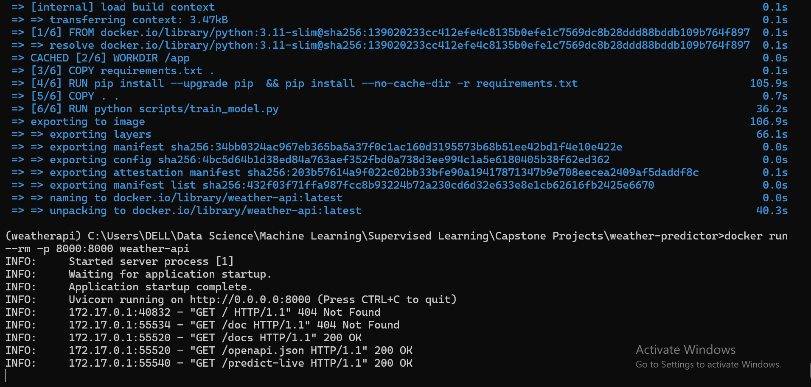
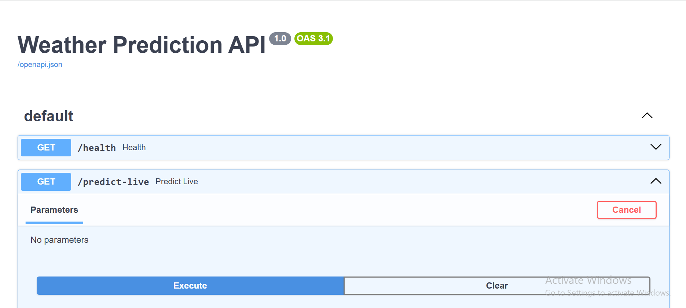
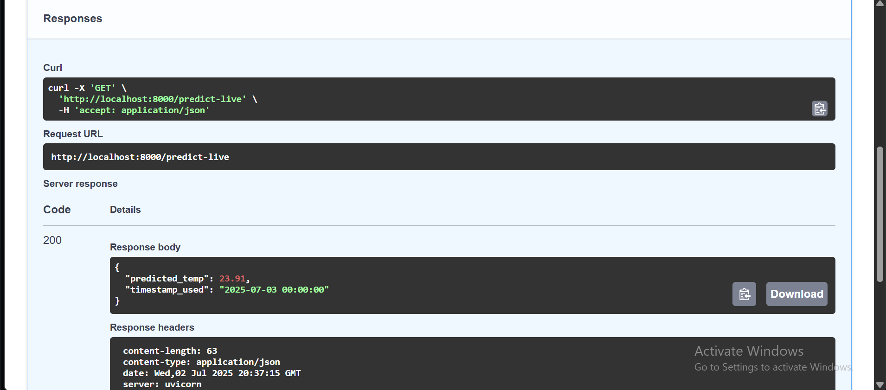

# Weather Forecasting System (ML + FastAPI + Docker + CI)

Production-grade weather prediction pipeline using machine learning, real-time API data collection, FastAPI-based model deployment, and automation with GitHub Actions — all powered by CSV file storage only.

---

## 1. Project Motivation

This project simulates an end-to-end ML production system under minimal infrastructure constraints (no databases). It focuses on reproducible engineering workflows, live data integration, and clean, testable deployment.

---

## 2. Features

- Hourly live weather data ingestion using the Open-Meteo Archive API.
- Supervised ML model predicting next-hour temperature
- FastAPI for inference
- Dockerized app containerization
- CI pipeline with Pytest and Docker build check
- CSV-based storage (no SQL/NoSQL database used)
- Logging and error handling with loguru and Pydantic validation

---

## 3. Project Structure

```
weather-predictor/
├── app/
│   ├── __init__.py
│   ├── main.py              # FastAPI app
│   └── model.py             # ML model loader and predictor
├── data/
│   ├── historical_weather.csv
│   ├── DATA_FRAME.csv
│   └── live_weather.csv
├── model/
│   └── weather_pipeline.pkl # Trained model artifact
├── scripts/
│   ├── fetch_and_save.py    # Historical data collector
│   ├── load_data.py         # Data loader
│   ├── feature_engineer.py  # Feature extraction
│   ├── train_model.py       # Model training script
│   ├── evaluate_model.py    # Evaluation metrics
│   └── live_collector.py    # Live data appender
├── tests/
│   ├── test_data_validation.py
│   └── test_train_model.py
├── .github/workflows/ci.yml # GitHub Actions CI
├── Dockerfile
├── requirements.txt
├── .dockerignore
└── README.md
```

---

## 4. Tech Stack

- ML: scikit-learn, pandas, joblib
- API: FastAPI, Pydantic, Uvicorn
- Data Collection: requests, tenacity, dotenv
- Visualization: seaborn, matplotlib
- Automation: GitHub Actions, Pytest
- Packaging: Docker

---

## 5. Local Execution(FastAPI)

### 5.1 Environment Setup

```
conda create -n weatherapi python=3.12 -y
conda activate weatherapi
```

### 5.2 Clone the Repository

```
git clone https://github.com/Amaan-developpeur/WeatherPredictionAPI.git
cd WeatherPredictionAPI
```

### 5.3 Install Dependencies

```
pip install -r requirements.txt
```

### 5.4 Run the API Server

```
uvicorn app.main:app --reload
```

Open: http://127.0.0.1:8000/docs

---

## 6. Setup Instructions

### 6.1 Clone the Repository

```
git clone https://github.com/Amaan-developpeur/weather-predictor.git
cd weather-predictor
```

### 6.2 Install Requirements

```
pip install -r requirements.txt
```

### 6.3 Environment Variables

Create a `.env` file with:

```
OPENWEATHERMAP_API_KEY = "https://archive-api.open-meteo.com/v1/archive" 
[To do API Call]
```

---

## 7. Running Tests

```
pytest -v
```

---

## 8. Docker Usage

```
docker build -t weather-api .
docker run --rm -p 8000:8000 weather-api
```

Open: http://localhost:8000/docs

---

## 9. Docker CLI Output

This shows the container running and exposing the FastAPI app:



---

## 10. Continuous Integration

- Workflow: `.github/workflows/ci.yml`
- Stages: checkout → setup Python 3.11 → install dependencies → run tests → (optional) Docker build


## 11. API Usage

### 11.1 Example Input

```
{
  Directly hit the execute buttoon, it will fetch the live data and do prediction about the next hour.
```

### 11.2 Example Output

```
{
  "predicted_temperature": 32.1
}
```

Visit Swagger docs at: `http://localhost:8000/docs`

---

## 12. Images

### 12.1 Swagger UI

This shows the interactive API documentation served at `/docs`:



### 12.2 Model Prediction Output

Example response after hitting the `/predict-live` endpoint:



---

## 13. License

This project is licensed under the [MIT License](LICENSE).  
You are free to use and modify.

